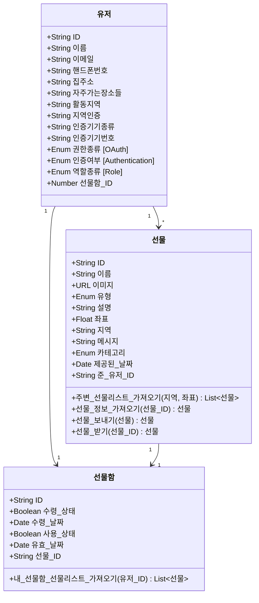

# 08.02 (화)

- [ ] 사용자 간 선물을 보내고 선물을 받는다
- [ ] 선물 주기, 받기에서 NFT를 사용한다
- [ ] 사용자가 앱을 키면 지도에 사용자 주변 일정 거리까지 선물 정보가 나타난다
- [ ] 선물을 누르면 포켓몬고와 비슷한 화면이 나온다.
- [ ] 다양한 이벤트(예: 포켓몬 볼로 잡기)로 선물을 획득한다
- [ ] 획득한 선물이 리스트로 나타나는 페이지가 있다
- [ ] 선물 리스트 페이지에서 선물을 클릭하면 해당 선물에 대한 정보를 받을 수 있다
- [ ] 페이지 수 자체는 별로 없을 것 같다.

1. 아래 내용중에 소프트웨어 사양인것과 그렇지 않은것을 구분하세요.
   1. 소프트웨어 사양
      1. 사용자 간 선물을 보내고 선물을 받는다
      2. 선물 주기, 받기에서 NFT를 사용한다
      3. 사용자가 앱을 키면 지도에 사용자 주변 일정 거리까지 선물 정보가 나타난다
      4. 획득한 선물이 리스트로 나타나는 페이지가 있다
      5. 선물 리스트 페이지에서 선물을 클릭하면 해당 선물에 대한 정보를 받을 수 있다
   2. 소프트웨어 사양이 아닌 것
      1. 선물을 누르면 포켓몬고와 비슷한 화면이 나온다.

         > 오답 → 소프트웨어 사양 정보: 선물, 화면

      2. 다양한 이벤트(예: 포켓몬 볼로 잡기)로 선물을 획득한다

         > 오답 → 소프트웨어 사양 정보: 다양한 이벤트, 선물, 획득

      3. 페이지 수 자체는 별로 없을 것 같다.
2. 위 내용중에서 모델링이 필요한 도메인 오브젝트를 찾아보세요. 클래스 다이어그램을 이용하여도 좋습니다. → 도메인 오브젝트 - 명사

   ```mermaid
   classDiagram
       class 유저 { }

       class 선물함 { }
   		%% "선물을 획득한다" 에서 찾은 도메인

   		%% class 주문 { }
   		%% 문장에서 추론할 수 없는 도메인으로 삭제

       class 선물 { }

   		%% class 후기글 {  }
   		%% 도메인이 아니라 "필요하겠지?" 라는 상상
   ```

3. 2번에서 만들어진 모델의 필요한 속성이 무엇이 있을지 예상해보세요. 클래스 다이어그램을 그려도 좋습니다. → 명사에 필요한 속성이 무엇이 있는지 예상

   ```mermaid
   classDiagram
       class 유저 {
   				+String ID
           +String 이름
           +String 이메일
           +String 핸드폰번호
           +String 집주소
           +String 자주가는장소들
           +String 활동지역
           +String 지역인증
           +String 인증기기종류
           +String 인증기기번호
           +Enum 권한종류 [OAuth]
           +Enum 인증여부 [Authentication]
           +Enum 역할종류 [Role]
           +String 선물함_ID
       }

       class 선물함 {
   				+String ID
           +Boolean 수령_상태
           +Date 수령_날짜
           +Boolean 사용_상태
           +Date 유효_날짜
           +String 선물_ID
       }

       class 선물 {
   				+String ID
           +String 이름
           +URL 이미지
           +Enum 유형
           +String 설명
           +Float 좌표
           +String 지역
           +String 메시지
           +Enum 카테고리
           +Date 제공된_날짜
           +String 준_유저_ID
       }
   ```

4. 2번에서 만들어진 각 도메인 오브젝트들의 관계를 찾아보세요. → 명사 간 관계 찾기

   ```mermaid
   classDiagram
   		유저 "1" --> "*" 선물
       유저 "1" --> "1" 선물함
       선물 "1" --> "1" 선물함
   ```

5. 2번에서 만들어진 각 도메인의 행동 (행위)를 찾아보세요. → UseCase 찾기

   1. 사용자 간 선물을 보내고 선물을 받는다
   2. 사용자 주변 일정 거리까지 선물 정보가 나타난다
   3. 획득한 선물이 리스트로 나타나는 페이지가 있다
   4. 선물을 클릭하면 해당 선물에 대한 정보를 받을 수 있다

   ```mermaid
   classDiagram
       class 유저 {

       }

       class 선물함 {

           +내_선물함_선물리스트_가져오기(유저_ID) List~선물~
       }
       %% 획득한 선물이 획득한 지역에서만 사용 가능한지 ?

       class 선물 {

           +주변_선물리스트_가져오기(지역, 좌표) List~선물~
           +선물_정보_가져오기(선물_ID) 선물
           +선물_보내기(선물) 선물
           +선물_받기(선물_ID) 선물
       }
       %% 선물의 유효기간이 있는지 ?
       %% "선물의 만료" 라는 개념이 있는지 ?
       %% 선물의 조회, 거절된 횟수를 카운트 해야하는지 ?
       %% 선물의 획득 경로가 있다면 ?
   				%% 길을 지나가다가
   				%% 상점을 통해
   				%% 카톡을 통해 오는 경우 ??
   ```

6. (1,2,3,4,5)번을 진행하면서 다음에 Domain expert (김서호) 에게 질문할 질문지를 작성해보세요.

   -

### 전체 관계도



---

## 배운 것 정리

### 소프트웨어 사양이란 ?

단순하게 말하면 소프트웨어의 전체적인 속성과 기능 + 환경이라고 할까요.

예를들어서 분석된 도메인도 일종의 사양입니다. 도메인은 속성과 구동으로 나뉘면서 모델링되고 그럼 클래스가 되겠죠.

클래스 안쪽에 있는 속성은 나중에 데이터베이스에 저장하지만 전부다 하는건 아닙니다. 구동은 의미있는 하나의 행위를 뜻하죠

예를들어서 사진을 찍는다. 라고 했을때 소프트웨어 사양서에는 사진을 찍는다 ( 픽셀, 화소, 촬영거리, 저장장소, 파일형식 기타등등 … )

- 소프트웨어 사양이 아닌 예시: `페이지 수 자체는 별로 없을 것 같다.`
  - 위 문장에서는 중요한 주사 혹은 동사에 대한 정보가 없다

### Domain Export가 전달한 것들을 아래와 같은 순서대로 처리한다

1. 위 내용중에 소프트웨어 사양인것과 그렇지 않은것을 구분한다
2. 위 내용중에서 모델링이 필요한 도메인 오브젝트를 찾는다
3. 2번에서 만들어진 모델의 필요한 속성이 무엇이 있을지 예상하여 작성해본다.
4. 2번에서 만들어진 각 도메인 오브젝트들의 관계를 찾는다.
5. 2번에서 만들어진 각 도메인의 행동 (행위)를 찾는다
6. (1,2,3,4,5)번을 진행하면서 다음에 Domain expert 에게 질문할 질문지를 작성한다

- 일단 주어진 범위 내에서만 분석하는 습관을 들여야 한다.
- 분석 업무로 주어진 정보 이외의 정보는 반드시 익스퍼트에게 확인 후 반영해야한다.
  - 확인 해야하는 사항들을 리스트업 해놓는 습관이 필요하다
- 분석/설계가 논리적이라면 반드시 코드는 자연스럽게 만들어지기 때문에 분석/설계에서는 절대 코드를 고려하지 않는다
